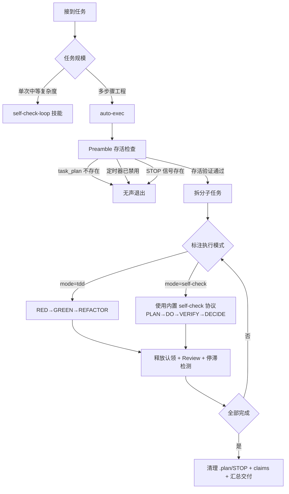

# Auto-Exec — 自主执行编排

将开发目标自动分解为可执行任务，通过跨会话批量执行持续工作数小时，无需用户监督。

集成：Intent Gate × ECC 安全分级 × TDD 雪球 × Review Checklist × PRD 门禁 × .plan/ 持久化

## 触发条件

当用户表达以下意图时激活 `/auto-exec`：
- "自动执行""持续做""不间断""跑几小时"
- 给了多步骤目标，表示不需要在旁边监督
- 明确说 `/auto-exec <目标>` 或 `/auto-exec "<指令>"`

**不触发：** 简单查询、一次性的明确指令、纯对话。

**紧急 bug 修复触发规则：**
- 止血型（根因明确、改动 ≤3 文件、5-10 分钟能修完）→ 不走编排，当前会话直接修复
- 排查型（根因不确定、需多路径探索）→ 必须走编排，轮询间隔缩短到 **1 分钟**
- 分界判断：能否 30 秒内说清楚改哪几个文件怎么改。能 → 止血型；不能 → 排查型

---

## 工作流程

### Phase 0: 目标接收与意图分类 (Intent Gate)

接收用户目标后，先分类：

| 类型 | 特征 | 行动 |
|------|------|------|
| **简单查询** | "X怎么用""Y在哪" | 直接回答，不启动 auto-exec |
| **明确指令** | "在 Z 文件实现 X 功能" | 当作 Phase 1 输入，可启动 auto-exec |
| **调研探索** | "怎么实现的""有哪些" | 先做调研再决定是否编排 |
| **开放任务** | "重构一下""优化""加功能" | 先反问确认方向再启动 |
| **模糊需求** | 意图不清、多种理解 | 反问澄清，不启动 |

只有**明确指令**和**开放任务（澄清后）**才进入 auto-exec。

### Phase 1: 风险分级 (ECC)

对目标拆解出的每个要点标注风险等级：

| 等级 | 特征 | 处理 |
|------|------|------|
| **🔵 低** | 文件操作、测试、重构、纯后端逻辑 | 全自动，无需确认 |
| **🟡 中** | 新增功能、API 变更、数据库迁移 | 执行，但完成时 notify 确认 |
| **🔴 高** | 删除文件/分支、force push、破坏性操作、改配置/密钥、对外操作（发邮件/推） | **暂停，等你确认** |

高风险项写入 `.plan/progress.md` 的 `blocked` 列表，在你确认前不执行。

### Phase 2: 任务分解

把目标拆成可执行的子任务，写入 `.plan/task_plan.md`：

**拆解规范：**
- 每个任务 ≤ 30 分钟工作量
- 明确依赖关系（DAG）
- 标注 PRD-impact: true/false
- 标注 risk: low/medium/high
- 标注 test-required: true（默认 true）
- 标注 verification-criteria（验证标准，可量化）
- **标注 mode: tdd / self-check / auto**（执行模式，强制必填）

#### 执行模式选择规则

| mode | 适用场景 | 验证方式 | 说明 |
|------|---------|---------|------|
| **tdd** | 代码逻辑、算法、API 实现 | RED→GREEN→REFACTOR + pytest | 默认模式，有明确"对/错"判断 |
| **self-check** | 设计、文案、架构、prompt 模板、UI 设计 | PLAN→DO→VERIFY→DECIDE（自评 ≥8） | 没有测试可写，需要迭代打磨 |
| **auto** | 不确定用哪种 | 由 worker 自行判断 | 仅用于歧义任务，worker 选择后更新 task_plan.md |

**强制规则：** 每个任务必须有 mode。Phase 2 拆任务时，按上述规则填入。漏填 = 任务不完整，worker 启动时退回重填。

#### task_plan.md 模板

```markdown
# 项目: <项目名>
# 目标: <一句话目标>
# 创建: <日期>

## 任务清单

| # | 任务 | 依赖 | 风险 | PRD | 测试 | 模式 | 验证标准 | 状态 |
|---|------|------|------|-----|------|------|---------|------|
| 1 | 实现 auth API | - | low | no | yes | tdd | pytest 全绿 | pending |
| 2 | 设计 prompt 模板 | 1 | low | yes | no | self-check | 每项 ≥8 分 | pending |

## 说明
- DAG 图示（文字描述或 mermaid）
- 特殊注意事项
- 引用的 AGENTS.md 或 CLAUDE.md 段落
```

**验证标准编写原则：**
- 必须是可客观判断的条件（"测试全绿""接口返回 200""内存 < 800MB"）
- 避免主观标准（"代码质量好""看起来没问题"）
- 最好可量化（"延迟 < 200ms""覆盖率 > 80%"）

#### progress.md 模板

```markdown
# 进度

## 当前状态
- 当前任务: #
- 已完成: #/#
- 本轮执行: <session 时间戳>

## 决策记录
- <决策内容> — <决策原因>

## 采纳率追踪
- 本轮产出: accept N / reject N → 采纳率 N%
- 累计: accept N / reject N → 采纳率 N%
- 低采纳原因: <如果采纳率 < 50%，记录原因>

## 阻塞项（需你确认）
- [ ] 高风险操作 #N: <描述>
```

### Phase 2.5: Knowledge Module — 上下文注入（可选优化）

为提升 batch 执行效率，可向 `.plan/knowledge/` 目录写入任务相关的最佳实践提示，worker 每轮轮询时预加载。每个 knowledge 文件使用以下格式：

```markdown
---
scope: 适用范围（什么条件下采用，如"当修改 pytest 文件时"）
rules:
  - 具体的行为规则 1
  - 具体的行为规则 2
---
```

Worker 在执行步骤 3-4 之间，扫描 `.plan/knowledge/` 目录，读取 scope 匹配当前任务的 knowledge 文件。

典型场景：
- **项目特定测试模式**："pytest 使用 pytest-asyncio，fixture 范围避免共享状态污染"
- **常用 API 签名**："orchestrator API 使用 POST /api/v1/…，请求头含 Authorization: Bearer"
- **已踩过的坑**："不要直接修改 .clinerules，通过 core-rules.md 覆盖"

### Phase 3: 执行启动

1. 将 `.plan/task_plan.md` 和 `.plan/progress.md` 写入 workspace 根目录
2. 创建 `scheduled task`（间隔根据任务类型选择）：

```yaml
# 常规任务 — 每 1 分钟（batch 模式，高吞吐）
taskId: auto-exec-<目标简称>
cronExpression: "*/1 * * * *"

# 排查型紧急 bug — 每 1 分钟（根因不确定需要快速迭代）
taskId: auto-exec-fix-<bug简称>
cronExpression: "*/1 * * * *"
```

3. 将 `.plan/STOP` 信号机制写入 worker prompt（见下文 Preamble 步骤）

**停止传播：** 任何时候 disable scheduled task，必须**同时**写入 `.plan/STOP` 文件（空文件即可）。Worker 每次启动时检查该文件，若存在则立即退出。清理时用 `rm -f .plan/STOP`。

#### Worker prompt 模板

```yaml
notifyOnCompletion: true
prompt: |
  # Auto-Exec Worker（Batch 模式）

  你是一个自主执行工作器。读取 .plan/ 文件，在当前会话中尽可能多地完成 pending 任务。

  ## ⚠️ Preamble — 存活检查（在任何实际工作之前执行）

  以下检查按顺序执行，任一失败则**立即退出，不做任何代码修改**：

  1. **task_plan 存在检查**：确认 `.plan/task_plan.md` 文件存在。若不存在 → 工作已完成或从未启动 → 立即退出
  2. **scheduled task 存活检查**：调用 `mcp__scheduled-tasks__list_scheduled_tasks` 确认本 auto-exec 定时任务 `{taskId}` 仍处于 `enabled: true`。若已禁用 → 立即退出
  3. **STOP 信号检查**：确认 `.plan/STOP` 文件不存在。若存在 → 立即退出（不下发清理，让后续 worker 也看到该信号）
  4. **Claims 目录初始化**：确保 `.plan/claims/` 目录存在（`mkdir -p .plan/claims`）
  5. **Session 注册**：生成唯一 session ID（可用 `date +%s%N`），写入 `.plan/claims/_sessions/{session-id}` 作为心跳标记

  以上任意检查不通过，**直接 return，不要做任何文件修改、git 操作、代码写入**。

  ## 每轮执行步骤

  1. **分支检查**：运行 `git branch --show-current`
     - 如果在 main 或目标特性分支 → 继续
     - 如果不在或分离 HEAD → 创建 `feat/auto-exec-<任务简称>` 并切换
  2. 读取 `.plan/progress.md`，确定下一个 pending 任务
  3. 读取 `.plan/task_plan.md` 确认任务详情（验证标准 + 执行模式）
  4. 读取目标项目 CLAUDE.md + .clinerules + AGENTS.md 理解开发规范
  5. 加载所有项目 `.clinerules` 文件（全局 + 子项目）
  6. **任务认领**：执行任务前在 `.plan/claims/{task-id}/` 下写入 session 标记。若该目录已存在其他 session 的 claim → 跳过该任务，选下一个 pending
  7. **检查执行模式**：
     - mode=tdd → 走 TDD 雪球流程
     - mode=self-check → 走 self-check 协议（见下文内置模板）
     - mode=auto → 自行判断并更新 task_plan.md
     - 无 mode 列或为空 → 退回，标记任务不完整
  8. **批量执行**（按对应模式的质量门禁）
     - 每完成一个独立逻辑变更 → `git add <文件> && git commit -m "类型(范围): 描述"`
     - 每完成一个 pending 任务 → 写 checkpoint 到 progress.md
  9. **释放认领**：任务完成后删除 `.plan/claims/{task-id}/` 目录
  10. 收集采纳反馈：本轮产出是否被接受？记录到 progress.md 的采纳率追踪
  11. **停滞检测**：检查是否连续 3 轮对同一文件/错误做不同尝试未解决 → 标记 stuck
  12. 更新 `.plan/progress.md`（写 checkpoint，含已用 token 估算）
  13. **推送**：运行 `git push`
      - 至少每 3 个 commit 推送一次（防止本地 commit 丢失）
      - batch 结束时强制推送
      - 如果 push 失败（远程有更新），先 `git pull --rebase` 再 push
  14. **知识收割**：扫描本轮执行，提取三类信息写入 `.plan/knowledge/`：
      - `pitfalls.md` — 本轮什么方案失败、原因（无失败写「无异常」）
      - `discoveries.md` — 偶然发现的有用信息（如无则跳过）
      - `patterns.md` — 跨任务重复出现的模式（如无则跳过）
      后续轮次执行 Phase 2.5 时自动加载这些 knowledge 文件
  15. **适应性退出检查**：
      - 估算当前上下文使用率（消息轮数 + 读取的文件大小）
      - 如果上下文接近上限（>70%），退出等待下次轮询
      - 如果还有大量上下文余量，继续执行下一个 pending 任务（回到步骤 2）
      - 如果所有任务完成 → 清理 `.plan/` → 通知完成

  ## 质量门禁（每次执行必须完成）

  根据 task_plan.md 中该任务的 mode 选择对应的门禁：

  ### mode=tdd — TDD 雪球
  - RED（写失败测试）→ GREEN（最小实现）→ REFACTOR
  - 回归测试：修改了哪个文件，先检查是否有相关测试可扩展
  - 运行 `pytest` 或对应项目测试命令，全绿才能继续

  ### mode=self-check — Self-Check 协议
  使用以下内置模板执行：

  ```
  ▸ SELF-CHECK LOOP（内置协议）
  TASK: 从 task_plan.md 读取
  SUCCESS CRITERIA: 从 task_plan.md 读取（验证标准列）

  每轮执行：
  1. PLAN — 说明下一步具体要做什么
  2. DO — 产出或改进
  3. VERIFY — 按每条标准给结果打 1-10 分，诚实列出不达标项
  4. DECIDE — 全 ≥8 输出 FINAL 并停止；否则输出 ITERATING，
             优先修复分数最低的那一项
  RULES: 每条达 8 分前不准完成，不准提问，自行假设并推进
  ```

  - 每轮完整执行 PLAN→DO→VERIFY→DECIDE
  - 直到输出 FINAL 为止
  - 如果超过 8 轮仍未 FINAL，标记任务为 blocked（标准太高或任务太模糊）
  - 不依赖外部 skill 激活，协议已内置在 prompt 中

  ### 通用门禁（两种 mode 都执行）

  **Review Checklist：**
  - 正确性：代码做了什么，符合预期吗？
  - 安全：SQL 参数化？输入校验？密钥泄露？
  - 错误处理：异常被正确处理了吗？有 logging 或 re-raise 吗？
  - 边界：空列表、None、超大输入时表现？
  - 测试/验证：tdd 模式检查测试；self-check 检查打分记录

  **PRD 门禁：**
  - 如果 `task_plan.md` 标注 PRD-impact: true
  - 或者本次改动涉及功能/需求/用户流程
  - **必须**同步更新对应项目的 PRD 文档
  - 更新后 commit message 注明 PRD 同步

  **停滞检测：**
  - 检查本轮是否在解决与前 2 轮相同的问题（同一文件、同一错误类型）
  - 如果连续 3 轮对同一个问题尝试不同方案但未解决：
    1. 记录所有已尝试方案到 progress.md 决策日志
    2. 标记该任务为 stuck
    3. 切换到下一个可执行任务
    4. 在完成通知中说明哪个任务被 stuck 及已尝试的方案
  - 此检测防止 Ralph Wiggum Loop（空转烧钱而不自知）

  **采纳率追踪：**
  - 每次执行完成，判断本轮产出是否被未来步骤接受
  - 记录 accept/reject 到 progress.md 采纳率追踪
  - 如果某任务累计采纳率 < 50%，记录低采纳原因
  - 如果持续低采纳，在完成通知中建议人工审核该任务方向

  ### Commit 规范
  - 格式: `类型(范围): 简短描述`
  - 类型: feat/fix/docs/refactor/test/ci
  - 每条 commit 一个独立逻辑变更（已在执行步骤 7 中强制执行）
  - 包含对 PRD 的更新（如果涉及）

  ## 完成条件

  所有任务状态为 completed 时，auto-exec 结束：
  1. 清理 `.plan/` 目录（含 `.plan/STOP`、`.plan/claims/`）
  2. 更新 MEMORY.md 记录执行摘要（含采纳率、stuck 任务）
  3. 禁用自身 scheduled task
  4. notify（已自动）

### Phase 4: 批量执行轮询

Scheduled task 自动运行，每轮批量执行多个任务（直到上下文接近上限）：

1. **Preamble 存活检查**（严格按顺序）：
   - task_plan.md 存在检查 → 不存在则 exit
   - scheduled task enabled 检查 → disabled 则 exit
   - STOP 信号检查 → 存在则 exit
   - Claims 目录初始化 + session 注册
2. **分支检查** → 确认在 main 或特性分支，否则创建 feat/<任务名>
3. **读 progress** → 找到下一个 pending 且依赖满足的任务
4. **任务认领** → 在 `.plan/claims/{task-id}/` 写入 session 标记；已有他人 claim 则跳过
5. **读 task_plan** → 确认任务的 mode + 验证标准
6. **停滞检测** → 检查上轮是否有未解决的重复尝试
7. **按 mode 执行**（tdd → TDD；self-check → 内置协议）
8. **释放认领** → 任务完成后删除 `.plan/claims/{task-id}/`
9. **测试/验证** → tdd 跑 pytest；self-check 完成 VERIFY 打分
10. **审查** → review checklist
11. **采纳记录** → 记录本轮产出是否被采纳
12. **PRD 同步**（如需要）
13. **Commit** → 每独立逻辑变更提交一次，不等到全部做完
14. **推送** → `git push`（每 3 个 commit 或 batch 结束时强制推送）
15. **更新 progress** → 当前任务标记 completed，写 checkpoint（含已用 token 估算），更新采纳率
16. **适应性退出** → 如果上下文余量 >30%，回到步骤 2 继续执行下一个 pending 任务；否则退出等待下次轮询
17. **全完成检查** → 所有任务 done → 清理退出

### Phase 5: 完成与清理

所有任务完成时：

1. ✅ 清理 `.plan/` 目录（含 `.plan/STOP`、`.plan/claims/`）
2. ✅ 合入 PR（如适用）
3. ✅ 更新 MEMORY.md（执行摘要，含采纳率指标和 stuck 任务清单）
4. ✅ Scheduled task 自动禁用
5. ✅ 通知你完成

---

## 与 7 阶段流程 + TDD 的映射

auto-exec **不是替代** 7 阶段流程或 TDD，而是它们的**执行载体**。三层嵌套，各管各的：

```
┌──────────────────────────────────────────────────┐
│              7 阶段流程 (AGENTS.md)                │  ← 项目级生命周期门禁
│  ┌────────────────────────────────────────────┐  │
│  │             auto-exec                        │  │  ← 跨会话执行编排
│  │  ┌──────────────────────────────────────┐  │  │
│  │  │  TDD  (mode=tdd)                     │  │  │  ← 原子任务执行方法
│  │  │  self-check (mode=self-check)        │  │  │
│  │  │  RED→GREEN→REFACTOR / VERIFY→DECIDE  │  │  │
│  │  └──────────────────────────────────────┘  │  │
│  └────────────────────────────────────────────┘  │
└──────────────────────────────────────────────────┘
```

### 阶段映射

```
你接到需求
  │
  ├── 阶段 0-3：AGENTS.md 检查 → 想法澄清 → PRD → 架构
  │   (对话中完成，与 auto-exec 无关)
  │
  ├── 阶段 4：开发计划
  │   └── auto-exec Phase 2 接管 → 拆子任务、标 mode、写 .plan/
  │
  ├── 阶段 5：编码
  │   └── auto-exec worker 逐轮执行：
  │       ├── Preamble → 存活检查（task_plan/定时器/STOP/Claims）
  │       ├── mode=tdd → RED→GREEN→REFACTOR (TDD)
  │       └── mode=self-check → PLAN→DO→VERIFY→DECIDE
  │
  ├── 阶段 6：代码评审
  │   └── auto-exec worker 内置 Review Checklist 自审
  │
  └── 阶段 7：发布
      └── auto-exec Phase 5 → commit + push + 通知
```

### 三层职责

| 层 | 管什么 | 关键问题 |
|----|--------|---------|
| **7 阶段流程** | 项目级质量门禁 | 该做的事都做了吗？（PRD 写了？架构审了？） |
| **auto-exec** | 跨会话执行编排 | 活太多一次做不完，怎么拆、怎么调度？ |
| **TDD / self-check** | 原子任务执行方法 | 这一小块代码/设计，怎么写才靠谱？ |

### 无冲突点

- 阶段 4 "拆任务" ≈ auto-exec Phase 2 — **同一件事**，触发 auto-exec 后自动完成
- 阶段 5 "TDD" ≈ auto-exec mode=tdd — **同一件事**，TDD 是 tdd 模式的内置门禁
- 阶段 6 "代码评审" ≈ auto-exec Review Checklist — **同一件事**
- 两者都要求 PRD 同步 — 路径一致
- auto-exec worker 自动读 AGENTS.md + .clinerules — 不需要额外步骤

---

## 与 self-check-loop 的关系

两个 skill 不重叠，**执行模式机制建立了强制配合关系**：



### 三种使用路径

| 路径 | 触发 | 执行模式 | 关系 |
|------|------|---------|------|
| **独立使用** | 你手动 `self-check-loop` skill | — | 两个独立 skill，互不依赖 |
| **auto-exec 内嵌** | task_plan.md 标注 mode=self-check | 内置协议 | auto-exec 强制 channel 到 self-check 协议 |
| **前后接力** | 你手动 self-check 后说"走 auto-exec" | tdd | 人工接力，产物喂给 auto-exec |

### 强制性的含义

- Phase 2 拆任务时，**必须**为每个任务标注 mode
- Worker 执行前检查 mode，缺失或无效值 → 退回不完整
- mode=self-check 时，worker 必须使用内置协议（不是建议，是指令）
- 内置协议在 worker prompt 中硬编码，不依赖外部 skill 启动
- 违反规则的标记（如 tdd 任务未写测试、self-check 任务未打分）→ review checklist 阶段拦截

---

## 执行原则

### 状态持久化
- `.plan/` 是唯一真理源，所有执行器读取它
- 不要依赖会话上下文，每次执行是全新会话
- 如果中途需要保存额外上下文，存到 `.plan/context/`

### Preamble 先于一切
- 任何 worker 启动后的第一件事是 Preamble 存活检查
- 存活检查失败 = 直接退出，**不写任何文件、不做任何 git 操作**
- worker prompt 中 Preamble 是最先出现的指令，优先级高于所有其他步骤

### Claims 认领机制
- 任务执行前必须在 `.plan/claims/{task-id}/` 下写入 session 标记
- 标记文件内容：session ID + 开始时间
- 认领后其他 session 看到已有 claim → 跳过该任务
- 任务完成或失败后删除 claim 文件
- 异常退出的 session 不会释放 claim，其他 session 会跳过该任务（避免重复执行）

### 停止传播
- Disable scheduled task 必须**同时写入 `.plan/STOP` 文件**
- Worker Preamble 检查 STOP 文件，存在则立即退出
- STOP 文件只由 Phase 5 的完成清理或你的手动操作删除
- STOP 文件不自动清理：确保后续 worker 也能看到停止信号

### 失败恢复
- 子任务执行失败：记录错误到 progress.md，标记任务为 failed
- 可恢复（如网络超时）：标记为 pending，下次重试
- 不可恢复（如代码不可能实现）：标记为 blocked，通知你决策
- 停滞检测仅标记 stuck，不阻塞其他无依赖任务
- 某任务失败不影响其他无依赖的任务执行
- self-check 超过 8 轮仍未 FINAL → 标记 blocked（标准太高或任务太模糊）

### 资源边界
- 严格遵守项目 .clinerules 和 CLAUDE.md 的资源约束
- 视频任务串行，内存上限 800MB
- 不启动新服务（无 Redis/Celery/RabbitMQ）
- 所有模块同进程运行

### 记忆与上下文
- 每个子任务完成后把关键发现写入 `.plan/progress.md` 的决策记录
- 执行完成时，摘要写入 MEMORY.md 和 `memory/` 目录（含采纳率指标）
- 不保留子 Agent 的中间输出

---

## 示例：完整执行流

```
你: /auto-exec "修复 content-aggregator 的 login 超时 bug，补充文档"

我 (Phase 0-1):
  ✓ Intent Gate → 明确指令，可 auto-exec
  ✓ ECC → 低风险

我 (Phase 2):
  ✓ 拆 2 个任务:
    (1) 修复 login 超时 — mode=tdd, 验证=测试全绿
    (2) 补充超时处理文档 — mode=self-check, 验证=完整性≥8/实用性≥8
  ✓ 写入 .plan/

我 (Phase 3):
  ✓ 创建 scheduled task, 每 1 分钟轮询（batch 模式）
  ✓ worker prompt 包含 Preamble + 分支检查 + 逐条 commit + push 步骤

[轮次 1 — Preamble → mode=tdd]:
  ✓ Preamble: task_plan 存在 ✓ → 定时器 enabled ✓ → STOP 不存在 ✓ → claims/ 初始化 ✓
  ✓ 分支检查 → 在 main，创建 feat/auto-exec-fix-login-timeout
  ✓ 认领 → 写入 .plan/claims/1/{session-id}
  ✓ TDD: RED→GREEN→REFACTOR, pytest 全绿
  ✓ 释放 → 删除 .plan/claims/1/
  ✓ 每独立变更 commit: `fix(login): increase timeout to 30s`
  ✓ 停滞检测 → OK
  ✓ git push（第 1 个 commit）

[轮次 2 — Preamble → mode=self-check]:
  ✓ Preamble: 存活验证通过
  ✓ 认领 → 写入 .plan/claims/2/{session-id}
  ✓ 阶段 1: PLAN → 确定文档大纲
  ...
  ✓ 释放 → 删除 .plan/claims/2/
  ✓ 每独立变更 commit: `docs(login): add timeout parameter description`
  ✓ batch 结束强制 push

[完成]:
  ✓ 清理 .plan/（含 STOP + claims/）
  ✓ 更新 MEMORY.md
  ✓ 通知: "2/2 完成 | 采纳率 100% | self-check 迭代 2 轮"
```

## 停滞检测示例 (Ralph Wiggum Loop 防范)

```
[轮次 1]: 尝试方案 A 修复 test_login 超时 → 失败
[轮次 2]: 尝试方案 B 修复 test_login 超时（不同方法）→ 失败
[轮次 3]: 尝试方案 C 修复 test_login 超时（再次不同）→ 失败
         → 触发停滞检测！
         → 记录已尝试方案: [A: 增加超时时间, B: 异步改同步, C: mock 外部依赖]
         → 标记任务 3 为 stuck
         → 切换到任务 4
```

---

## 纪律

- **Preamble 不可绕过**：任何 auto-exec worker 的第一件事必须是 Preamble 存活检查，不能跳过。违反 = 违规执行
- **拆任务宁细勿粗**：≤30 分钟/Task，超过说明拆得不够细
- **子 Agent 只产出不审查**：Agent 子任务完成后由主会话做 review
- **不跳过测试**：test-required: false 只在极少数情况（纯文档、配置）允许
- **PRD 不是可选**：PRD-impact: true 的任务不做完 PRD 就不算完成
- **执行模式必填**：每个任务必须标注 mode，缺省 = 任务不完整，退回重填
- **self-check 强制走内置协议**：mode=self-check 的 worker 必须使用 PLAN→DO→VERIFY→DECIDE，不能用「读一下然后凭感觉过」
- **8 轮上限**：self-check 任务超过 8 轮仍未 FINAL → marked blocked，通知人工判断
- **停滞必检**：每轮执行必须检查是否在重复尝试同一问题，不检查就不算完成
- **采纳率是北极星指标**：不是跑了多少轮，而是被接受了多少
- **紧急 bug 分流**：止血型不走编排直接修；排查型走编排但轮询 1 分钟
- **谨记边界**：你是访客，你有权读写文件和代码，但对外操作（发消息、部署、推送社交）必须确认
- **先分支再动手**：每轮先确认分支，不在 main 上直接改
- **改完就 commit，不要攒**：每完成一个独立逻辑变更就 commit，不等到全部做完
- **push 不能忘**：batch 结束时强制 push，至少每 3 个 commit push 一次
- **disable 必写 STOP**：无论任何原因 disable auto-exec scheduled task，必须同时写入 `.plan/STOP` 文件，否则残留会话可能继续执行
